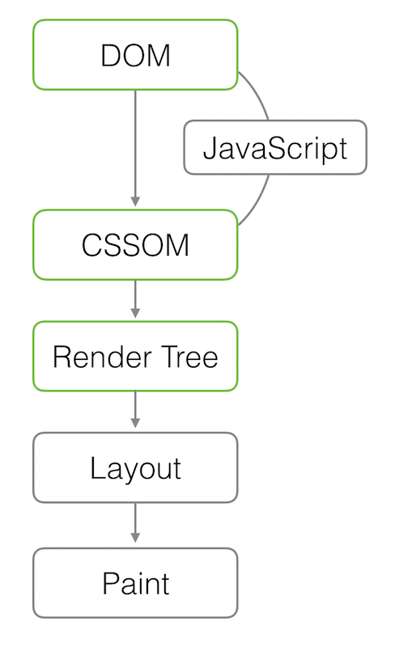
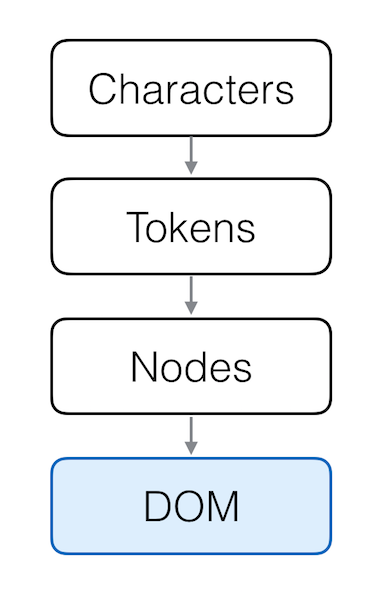
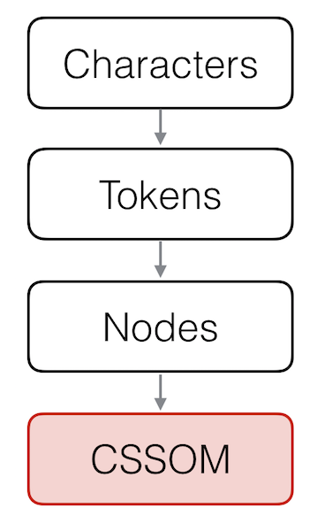

# Rendering

Before the browser can render the page it needs to construct the DOM and CSSOM trees. As a result, we need to ensure that we deliver both the HTML and CSS to the browser as quickly as possible.

## Document Object Model (DOM)

1. **Conversion**: the browser reads the raw bytes of the HTML off the disk or network and translates them to individual characters based on specified encoding of the file (e.g. UTF-8).

2. **Tokenizing**: the browser converts strings of characters into distinct tokens specified by the W3C HTML5 standard - e.g. '<html>', '<body>'' and other strings within the “angle brackets”. Each token has a special meaning and a set of rules.

3. **Lexing**: the emitted tokens are converted into “objects” which define their properties and rules.

4. **DOM construction**: Finally, the created objects are linked in a tree data structure that also captures the parent-child relationships defined in the original markup: HTML object is a parent of the body object, the body is a parent of the paragraph object, and so on.

The final output of this entire process is the **Document Object Model**, or the **DOM** of our simple page, which the browser uses for all further processing of the page.

## CSS Object Model (CSSOM)

The CSS bytes are converted into characters, then to tokens and nodes, and finally are linked into a tree structure known as the “CSS Object Model”, or CSSOM for short:

Why does the CSSOM have a tree structure? When computing the final set of styles for any object on the page, the browser starts with the most general rule applicable to that node (e.g. if it is a child of body element, then all body styles apply) and then recursively refines the computed styles by applying more specific rules - i.e. the rules “cascade down”.

## Render-tree construction

The CSSOM and DOM trees are combined into a render tree, which is then used to compute the layout of each visible element and serves as an input to the paint process which renders the pixels to screen. Optimizing each of these steps is critical to achieve optimal rendering performance.

The first step is for the browser to combine the DOM and CSSOM into a “render tree” that captures all the visible DOM content on the page, plus all the CSSOM style information for each node.

To construct the render tree, the browser roughly does the following:

1. Starting at the root of the DOM tree, traverse each visible node.
  - Some nodes are not visible at all (e.g. script tags, meta tags, and so on), and are omitted since they are not reflected in the rendered output.
  - Some nodes are hidden via CSS and are also omitted from the render tree.
2. For each visible node find the appropriate matching CSSOM rules and apply them.
3. Emit visible nodes with content and their computed styles.

> As a brief aside, note that 'visibility: hidden' is different from 'display: none'. The former makes the element invisible, but the element still occupies space in the layout (i.e. it's rendered as an empty box), whereas the latter (display: none) removes the element entirely from the render tree such that the element is invisible and is not part of layout.

## layout

The final output is a render that contains both the content and the style information of all the visible content on the screen - we’re getting close! With the render tree in place, we can proceed to the “layout” stage.

Up to this point we’ve calculated which nodes should be visible and their computed styles, but we have not calculated their exact position and size within the viewport of the device - that’s the “layout” stage, also sometimes known as “reflow.”

## Paint

Finally, now that we know which nodes are visible, their computed styles, and geometry, we can finally pass this information to our final stage which will convert each node in the render tree to actual pixels on the screen - this step is often referred to as “painting” or “rasterizing.”
