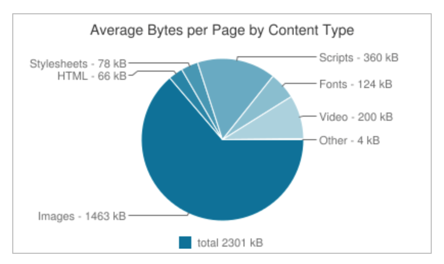

# Image Optimization

Images may be the largest part of your page content.

## Optimize your content

- Eliminate unnecessary image resources
- Leverage CSS3 effects where possible
- Use web fonts instead of encoding text in images

## Vector or Raster

- Vector images are ideal for images that consist of geometric shapes
- Vector images are zoom and resolution-independent
- Raster images should be used for complex scenes with lots of irregular shapes and details

## Screen size matters

- High resolution screens have multiple device pixels per CSS pixel
- High resolution images require significantly higher number of pixels and bytes
- Image optimization techniques are the same regardless of resolution

## Optimizing vector images

- SVG is an XML-based image format
- SVG files should be minified to reduce their size
- SVG files should be compressed with GZIP

## Optimizing raster images

- A raster image is a grid of pixels
- Each pixel encodes color and transparency information
- Image compressors use a variety of techniques to reduce the number of required bits per pixel to reduce file size of the image

## Selecting the right image format

- Start by selecting the right universal format: GIF, PNG, JPEG
- Experiment and select the best settings for each format: quality, palette size, etc.

| Format | Transparency | Animation | Browser |
| --- | --- | --- | --- |
| GIF | Yes | Yes | All |
| PNG |	Yes |	No | All |
| JPEG | No | No | All |
