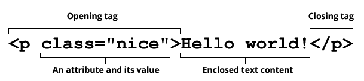

# Syntax


Let's take a closer look at following paragraph element.




```html
<p>Hello world!</p>
```


**Opening tag**: This consists of the name of the element (in this case, `p`), wrapped in opening and closing angle brackets. This states where the element begins, or starts to take effect (in this case where the start of the paragraph is).

**Closing tag**: This is the same as the opening tag, except that it includes a forward slash before the element name. This states where the element ends (in this case where the end of the paragraph is).

> Failing to include a closing tag is a common beginner error, and can lead to strange results.

**Content**: This is the content of the element, which in this case is just text.

**Element**: The opening tag, plus the closing tag, plus the content, equals the element.